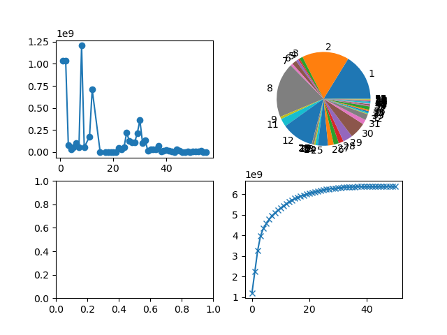

ICFP Programming Contest 2023
=============================
Carrying the idkjava tradition of doing the ICFP challenges solo this year.
See [icfpcontest2023.github.io](http://icfpcontest2023.github.io) for contest details.

This year's competition was about placing musicians on a stage to maximally satisfy a varied audience. We were given problem statements which described:

 * A rectangular music hall
 * A rectangular stage within the hall
 * List of integers describing which instrument each musician plays
 * List of attendees with position (outside the stage) and their ``tastes'' $t_i$ for each instrument type (both negative and positive)
 
The score was assigned based on a $t/d^2$ score for each (attendee, musician) pair. However, this simple continuous scoring function was altered for complexity: other musicians block sound rays traveling within 5 units of them, setting the effective (attendee, musician) score to zero in this case. The placement of musicians was also constrained to require >= 10 units of distance to any other musician and the edges of the stage.

Lightning round
===============
It seemed the big problems were fairly packed, meaning some kind of ``hard sphere'' simulation would not work well in these cases. Instead, I opted for a hexagonal packing to determine a grid of available coordinates. To suit problems with narrow geometries in one direction, it was also useful to assign a grid oriented both horizontally and vertically, taking the maximum score of the two.

Given coordinates, I compute the no-obstruction scores for each (instrument,coord) pair and use a priority queue to greedily place musicians. This was sufficient to achieve a total score ~6 billion. At the time of scoreboard freezing, the top score is ~9.5 billion, so not too far off the mark.

Here is a breakdown of the problem scores as of T-2 hrs on Saturday:

Of course, this misses the obstruction effects, which could be important in some cases. Since it seems hard to optimally solve this, even on the restricted grid, we need some heuristics / stochastic search. Implementing an efficient exact score evaluator (with obstruction) allowed experimentation here. Unfortunately a basic simulated annealing strategy with just swaps and assignments makes very little progress (1-5%) in most cases.
